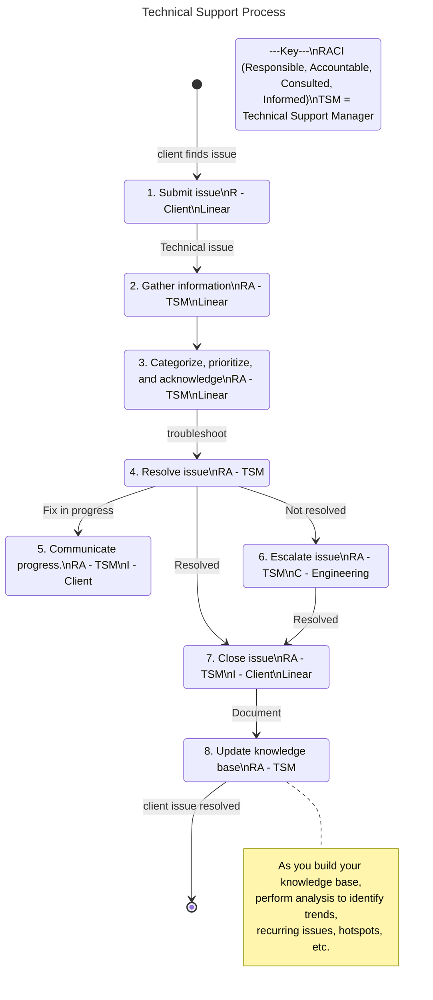

# Technical Support Processes

The following technical support process accounts for these high-level areas:

- **Ticketing System** - A central location to manage issues.
- **Intake and Triage** - Gather information about the issue and client, assess, and determine the *categorization and prioritization*.
- **Categorization and Prioritization** - Categorize the technical realm the issue falls under. Prioritize issue based on the urgency and impact of the issue.
- **Initial Response** - Acknowledge the clients issue and provide estimated time for fix. *Note: idk about this one. its good to keep continual communication and updates, but I want to manage expectations. I'll need to get into the weeds before I can even provide accurate time estimates.*
- **Troubleshooting and Resolution** - Assign the task of servicing the issue (ideally to a domain expert), they investigate, identify the root cause, and then resolve the issue.
- **Communication and Updates** - Maintain continuous communication with the client on updates throughout the *troubleshooting and resolution* subprocess.
- **Escalation** - When an issue is blocked, a subprocess for dealing with more complex issues is spun up. Continue with *Communication and Updates* until resolution.
- **Resolution and Closure** - Notify the client when you have a fix, receive client verification of resolution, and then close the issue.
- **Documentation and Knowledge Base** - Document the steps taken to resolve the issue. Both troubleshooting and the fix. Build up a knowledge base of case studies.
- **Analysis and Continuous Improvement** - Utilize your *Knowledge Base* to identify key insights. Ex. trends, recurring issues, and general hotspots.

## Process Map

For more information on process mapping, please use the README of my DAO process mapping [repository](https://github.com/sbvegan/dao-process-mapping).

***Note: this diagram utilizes Universal Process Notation (UPN), but with minor modifications to be more cohesive with GitHub (i.e. top to bottom, resource and subprocess links below).***

The following is a high level process map and it is intended to be understandable by anyone in the organization. If you need further information or the subprocess of a box; there are links to that information below.

### Subprocesses and resources

1. Submit issue
    - todo: subprocess
2. Gather information
    - todo: subprocess
3. Categorize, prioritize, and acknowledge
    - todo: subprocess
    - todo: resource: category descriptions
    - todo: resource: prioritization
    - todo: resource: response template
4. Resolve issue
    - todo: subprocess
    - todo: subprocess: identify WHO is responsible
    - todo: resource: HOW to troubleshoot guide
5. Communicate progress
    - todo: resource: guide on HOW to keep a client updated 
6. Escalate issue
    - todo: subprocess
7. Close issue
    - todo: resource: closure protocol
8. Update knowledge base
    - todo: subprocess: issue closure post-mortem
    - todo: resource: tips and tricks