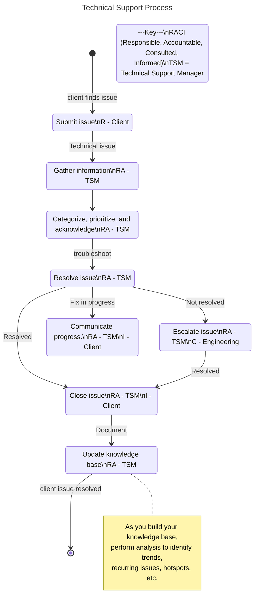

# Technical Support Process Map

An effective teechnical support process takes into account the following high-level areas/steps:

1. **Ticketing System** - A central location to manage issues.
1. **Intake and Triage** - Gather information about the issue and client, assess, and determine the *categorization and prioritization*.
    - todo: sub-process map
1. **Categorization and Prioritization** - Categorize the technical realm the issue falls under. Prioritize issue based on the urgency and impact of the issue.
    - todo: resource of category descriptions
    - todo: sub-process map for prioritization
1. **Initial Response** - Acknowledge the clients issue and provide estimated time for fix. *Note: idk about this one. its good to keep continual communication and updates, but I want to manage expectations. I'll need to get into the weeds before I can even provide accurate time estimates.*
    - todo: resource: HOW to respond/response template
1. **Troubleshooting and Resolution** - Assign the task of servicing the issue (ideally to a domain expert), they investigate, identify the root cause, and then resolve the issue.
    - todo: sub-process: identify WHO is responsible
    - todo: resource: HOW to troubleshoot guide
1. **Communication and Updates** - Maintain continuous communication with the client on updates throughout the *troubleshooting and resolution* sub-process.
    - todo: resource: guide on HOW to keep a client updated 
1. **Escalation** - When an issue is blocked, a sub-process for dealing with more complex issues is spun up. Continue with *Communication and Updates* until resolution.
    - todo: guide: HOW/WHEN to escalate an issue
1. **Resolution and Closure** - Notify the client when you have a fix, receive client verification of resolution, and then close the issue.
    - todo: resource: closure protocol
1. **Documentation and Knowledge Base** - Document the steps taken to resolve the issue. Both troubleshooting and the fix. Build up a knowledge base of case studies.
    - todo: sub-process: issue closure post-mortem
1. **Analysis and Continuous Improvement** - Utilize your *Knowledge Base* to identify key insights. Ex. trends, recurring issues, and general hotspots.
    - todo: resource: tips and tricks

