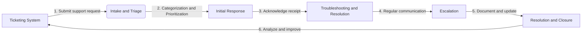

# Technical Support Processes

An effective teechnical support process takes into account the following high-level areas/steps:

1. Ticketing System
2. Categorization and Prioritization
3. Intake and Triage
4. Initial Response
5. Troubleshooting and Resolution
6. Communication and Updates
7. Escalation
8. Documentation and Knowledge Base
9. Resolution and Closure
10. Analysis and Continuous Improvement

