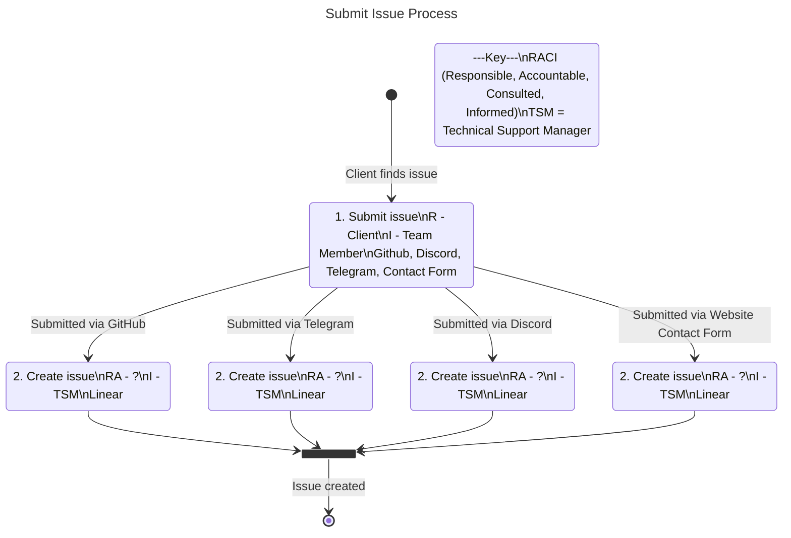

# Submit Issue

This process outlines the when a client finds an issue to the issue being created in the ticket management software.

## Subprocesses and resources

2. todo: resource: how to create an issue on Linear