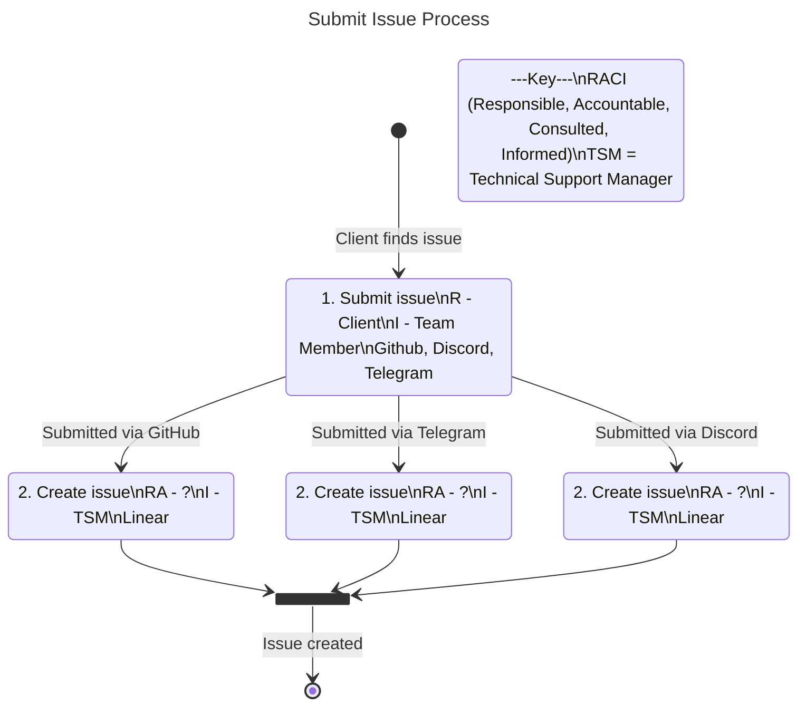

# Submit Issue

```mermaid
---
title: Submit Issue Process
---
stateDiagram-v2
    ISSUE: 1. Submit issue\nR - Client\nI - Team Member\nGithub, Discord, Telegram
    GITHUB: 2. Create issue\nRA - ?\nI - TSM\nLinear
    TELEGRAM: 2. Create issue\nRA - ?\nI - TSM\nLinear
    DISCORD: 2. Create issue\nRA - ?\nI - TSM\nLinear

    [*] --> ISSUE: Client finds issue    
    ISSUE --> GITHUB: Submitted via GitHub
    ISSUE --> TELEGRAM: Submitted via Telegram
    ISSUE --> DISCORD: Submitted via Discord
    state join_state <<join>>
    GITHUB --> join_state
    TELEGRAM --> join_state
    DISCORD --> join_state
    join_state --> [*]: Issue created

    NOTE: ---Key---\nRACI (Responsible, Accountable, Consulted, Informed)\nTSM = Technical Support Manager
```

## Subprocesses and resources

2. todo: resource: how to create an issue on Linear